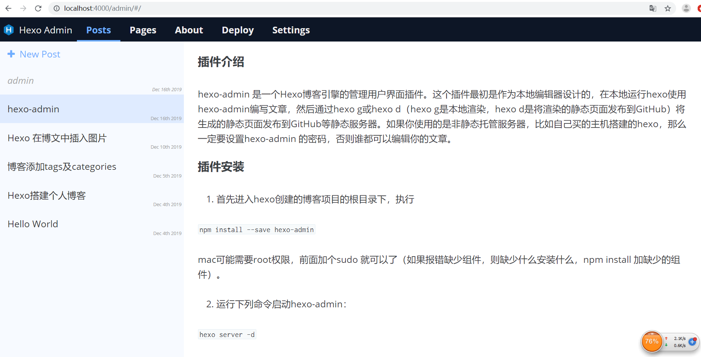

##### 插件介绍
hexo-admin 是一个Hexo博客引擎的管理用户界面插件。这个插件最初是作为本地编辑器设计的，在本地运行hexo使用hexo-admin编写文章，然后通过hexo g或hexo d（hexo g是本地渲染，hexo d是将渲染的静态页面发布到GitHub）将生成的静态页面发布到GitHub等静态服务器。
<!--more-->

##### 插件安装

1. 首先进入hexo创建的博客项目的根目录下，执行

`npm install --save hexo-admin`

mac可能需要root权限，前面加个sudo 就可以了（如果报错缺少组件，则缺少什么安装什么，npm install 加缺少的组件）。

2.  运行下列命令启动hexo-admin：

`hexo server -d`

打开 http://localhost:4000/admin/ 就可以访问到hexo-admin管理页面了。

